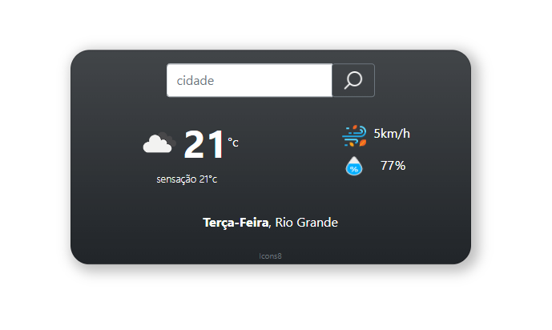

## [Weather App 🌤️](https://weather-rs.herokuapp.com/)

## API's utilizadas 👨‍💻
 

1. 'HTML Geolocation API', é uma api nativa de praticamente todos os navegadores, podemos solicitar ao usuário a liberação do acesso a geolocalização, além de  ser muito mais simples implementar.
2. [OpenWeather](https://openweathermap.org/) é uma API gratuita, porém ela utiliza uma chave para fazer as requisições.
 
 

## Link para testar a aplicação 💻

- ## [Weather app 🌤️](https://weather-rs.herokuapp.com/)

### Como usar

-> Ao clicar no link, se for a primeira vez, o navegador vai pedir acesso a sua localização.

-> Após isso, você pode pesquisar as informações sobre o tempo atual de qualquer outra cidade no mundo.

